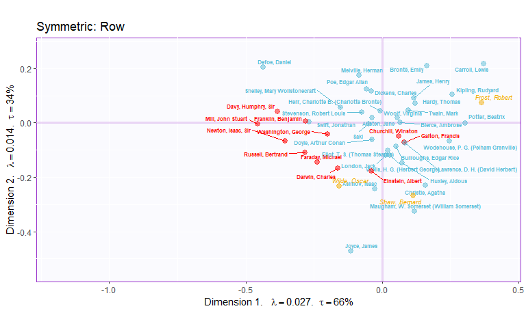
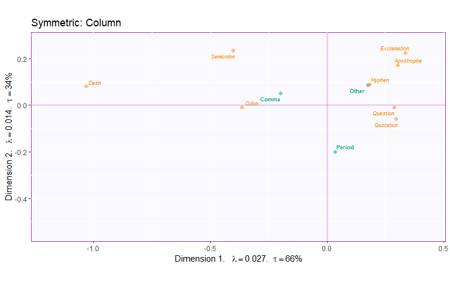

CA English Language Authors
================
Luke Moraglia
10/3/2019

This ‘recipe’ is for how to perform a Correspondence Analysis in R,
using inferential techniques of permutation and bootstrap.

## Method: CA

Correspondence Analysis (CA) decomposes the Chi-Square of a contingency
table, and serves as a dimension reduction technique for nominal
variables. CA takes a contingency table of two nominal variables and
uses the relative frequencies of each cell to plot out both rows and
columns in the same space. Plots can either be asymmetric (all distances
can be interpreted) or symmetric (only distances within a variable can
be interpreted). We will see how to perform CA and will look at both the
asymmetric and symmetric plots.

## Data Set: English Language Authors

This data set is sourced from Project Gutenburg. It represents
punctuation use for a sample of English language authors over their
entire career. I have also included their primary type of writing
(“Fiction” or “Non-Fiction”), birth year, gender, and nationality. In
the following example, we’ll look mainly at writing style and birth
year.

First, let’s import and clean the data.

``` r
load("../Data/EngLangAuthPunct.rda")

#Keep only the contingency table
auth.forCA <- auth.active %>% remove_rownames() %>% 
  column_to_rownames(var = "Author Name") %>% 
  select(Comma, Period, Other)

head(auth.forCA)
```

    ##                     Comma Period  Other
    ## Newton, Isaac, Sir  23149  11555   9176
    ## Defoe, Daniel      251542  58768 103966
    ## Swift, Jonathan    133745  64075  70767
    ## Franklin, Benjamin 113803  53353  58623
    ## Washington, George   3660   2082   2217
    ## Austen, Jane        65422  40465  59608

``` r
punct.sup <- punct.sup %>% remove_rownames() %>% 
  column_to_rownames(var = "Author Name")

head(punct.sup)
```

    ##                    Question Exclamation Colon Semicolon Hyphen Dash
    ## Newton, Isaac, Sir      131           2  2099      2716   2787    0
    ## Defoe, Daniel          3444        1187  6389     41432  16911    0
    ## Swift, Jonathan        2789        1482  9168     20715  12942  117
    ## Franklin, Benjamin     1707         794  3160     12616  22454    0
    ## Washington, George       10           2   118       320    390    0
    ## Austen, Jane           2857        3771  1051     11455  15627    0
    ##                    Apostrophe Quotation
    ## Newton, Isaac, Sir       1405        36
    ## Defoe, Daniel           23534     11069
    ## Swift, Jonathan         12126     11428
    ## Franklin, Benjamin      10341      7551
    ## Washington, George        187      1190
    ## Austen, Jane             6020     18827

``` r
auth.sup <- auth.sup %>%  remove_rownames() %>% 
  column_to_rownames(var = "Author Name") %>% 
  select(Comma, Period, Other)

head(auth.sup)
```

    ##               Comma Period Other
    ## Wilde, Oscar  68414  57909 40679
    ## Shaw, Bernard 78197 104958 95451
    ## Frost, Robert  1882   2085  4580

I’m going to grab some colors that we will use for graphs.

``` r
library(wesanderson)
darPal <- wes_palette("Darjeeling1", type = "continuous")
darRamp1 <- colorRampPalette(c(darPal[1], darPal[2]))
```

## Chi Square

The basis of CA is the Chi Square test. Whereas the Chi-Square statistic
is usually one number, we can visualize the individual residuals that
the CA will analyse.

``` r
chi2 <- chisq.test(auth.forCA)

inertia <- chi2$residuals / sqrt(sum(auth.forCA))

corrplot(t(inertia), is.corr = FALSE, tl.cex = 0.5, 
         col = darRamp1(100), cl.cex = 0.5, cl.length = 4,
         tl.col = "black")
```

<!-- -->

``` r
a0.residuals <- recordPlot()
```

## Analysis

This is how you might normally use `epCA.inference.battery`. It would
allow us to perform a CA in R and make inferences about our data.

``` r
#resCAinf.sym = epCA.inference.battery(auth.forCA, 
#                                   DESIGN = authors.with.birth$'Writing type',
#                                   symmetric = TRUE,
#                                   graphs = FALSE)

#resCAinf.asym = epCA.inference.battery(auth.forCA, 
#                                    DESIGN = authors.with.birth$'Writing type',
#                                    symmetric = FALSE,
#                                    graphs = FALSE)
```

Unfortunately, for our data, the estimated time to run would take 42
minutes, just for the first one. So we need another way to tackle this
problem. We need additional functions that aren’t included in a package
at the moment. They’re in a separate file that I just so happen to have.

``` r
source("InferencesMultinom4CA.R")
```

We need to instead use a multinomial approach.

``` r
#plain CA without inference
#symmetric
resCA.sym <- epCA(auth.forCA,
                  DESIGN = auth.active$`Writing type`,
                  symmetric = TRUE,
                  graphs = FALSE)

#asymmetric
resCA.asym <- epCA(auth.forCA,
                  DESIGN = auth.active$`Writing type`,
                  symmetric = FALSE,
                  graphs = FALSE)

#permutation test from "InferencesMultinom4CA"
resPermTest <- Perm4MultCA(auth.forCA, nIter = 1000)
```

Let’s look at the results.

``` r
resPermTest$pOmnibus
```

    ## [1] 0.001

``` r
resPermTest$pEigenvalues
```

    ## [1] 0.001 0.001

So we have some statistically significant eigenvalues. We can also use
the Malinvaud-Saporta test.

``` r
resMalinvaud <- MalinvaudQ4CA(Data = auth.forCA,
                              permutedEigenValues = resPermTest$permEigenvalues)

resMalinvaud
```

    ##                      Malinvaud-Saporta Test. Ho: Omnibus       Dim-1 Dim-2
    ## Inertia / sum lambda                              0.0405      0.0266 0.014
    ## Chi2                                         560988.6382 193251.8347 0.000
    ## p-Chi2                                            0.0000      0.0000 0.000
    ## df                                               82.0000     40.0000 0.000
    ## p-perm                                            0.0010      0.0010 0.001
    ##                      Dim-3
    ## Inertia / sum lambda     0
    ## Chi2                    NA
    ## p-Chi2                  NA
    ## df                       0
    ## p-perm                  NA

## Scree

Let’s look at the scree plot for our eigenvalues.

``` r
laScree <- PlotScree(ev = resCA.sym$ExPosition.Data$eigs,
                     p.ev = resPermTest$pEigenvalues)
```

<!-- -->

``` r
b0.scree <- recordPlot()
```

Both of our eigenvalues are significant. Look at the intertia extracted
by each. This number can be treated similar to a squared correlation, so
the effect is not much.

## Maps

Using the results from our CA above, we can calculate the factor scores
for our supplementary rows and columns.

``` r
fact.supI <- supplementaryRows(auth.sup, resCA.sym)
fact.supJ <- supplementaryCols(punct.sup, resCA.sym)
```

Next we’ll get the information we need to plot factor scores for both
the symmetric and asymmetric plots.

``` r
Fj.a <- resCA.asym$ExPosition.Data$fj
Fi   <- resCA.sym$ExPosition.Data$fi
Fj   <- resCA.sym$ExPosition.Data$fj

constraints.sym  <- minmaxHelper(mat1 = Fi, mat2  = Fj)
constraints.asym <- minmaxHelper(mat1 = Fi, mat2  = Fj.a)
constraints.sup  <- minmaxHelper(mat1 = rbind(Fi, fact.supI$fii), 
                                mat2  = rbind(Fj, fact.supJ$fjj) )

#colors for plots
col4authors.writ <- recode(resCA.sym$Plotting.Data$fi.col, "#305ABF" = darPal[1],
                           "#84BF30" = darPal[5])
birth.years <- auth.active$`Birth Year` - min(auth.active$`Birth Year`)
birth.years <- trunc(birth.years / max(birth.years) * 100) + 1
col4authors.birth <- darRamp1(101)[birth.years]

col4punct <- darPal[2]
col4punct.vect <- rep(col4punct, times = nrow(Fj))

#name the columns
colnames(Fi) <- paste0("Dimension ", 1:ncol(Fi))
colnames(Fj) <- paste0("Dimension ", 1:ncol(Fj))
colnames(Fj.a) <- paste0("Dimension ", 1:ncol(Fj.a))
```

### Asymmetric

``` r
# Your asymmetric factor scores
asymMap  <- createFactorMapIJ(Fi,Fj.a,
                              col.points.i = col4authors.writ,
                              col.points.j = col4punct,
                              col.labels.j = col4punct)

mapSup <- createFactorMapIJ(as.data.frame(fact.supI$fii), 
                            as.data.frame(fact.supJ$fjj)  ,
                            col.points.i = darPal[3],
                            col.labels.i = darPal[3] ,
                            font.face.i = 'italic',
                            alpha.labels.i = .8,
                            alpha.points.i = .8,
                            col.points.j = darPal[4],
                            col.labels.j = darPal[4],
                            alpha.labels.j = .9,
                            font.face.j = 'italic',
                            alpha.points.j = .8,
                            constraints = constraints.sup,
                            text.cex.i = 2.5,
                            text.cex.j = 2.5)

zePoly.J <-  PTCA4CATA::ggdrawPolygon(Fj.a, 
                                      color = col4punct,
                                      size = .2, 
                                      fill =  col4punct,
                                      alpha = .1)
# Labels
labels4CA <- createxyLabels(resCA = resCA.asym)

# Combine all elements you want to include in this plot
map.I.sup.asym <- asymMap$baseMap + zePoly.J + 
                          asymMap$I_points +
                          asymMap$J_labels + asymMap$J_points + 
                          mapSup$I_labels + mapSup$I_points +
                          labels4CA + 
ggtitle('Asymmetric Map with Supplementary Observations and Simplex')+
  theme(plot.title = element_text(size = 9))
map.I.sup.asym
```

<!-- -->

We plotted a triangle connecting the three vertices of the simplex\!
Since our smallest dimension is 3, all of our points exist in a 2D
plane, making our visual much easier to think about. The row profiles
are all points inside the simplex. In the asymmetric map all distances
are meaningful, so you could say that Robert Frost used “Other”
punctuation more frequently than the period or comma.

In these plots, authors in blue wrote primarily fiction, while those in
red wrote primarily non-fiction. Our supplementary authors are one poet,
and two playwrights.

### Symmetric

``` r
# factor scores
symMap  <- createFactorMapIJ(Fi,Fj,
                             col.points.i = col4authors.writ,
                             col.labels.i = col4authors.writ,
                             col.points.j = col4punct,
                             col.labels.j = col4punct,
                             text.cex.i = 2,
                             text.cex.j = 2.5,
                             constraints = constraints.sup)

# plot the row factor scores
map.sepI.sup.sym <- symMap$baseMap + 
  symMap$I_labels +                    
  symMap$I_points +
  ggtitle('Symmetric: Row') + 
  mapSup$I_points + mapSup$I_labels +
  labels4CA

map.sepI.sup.sym
```

<!-- -->

``` r
# plot the columns factor scores
map.sepJ.sup.sym <- symMap$baseMap + 
  symMap$J_labels + symMap$J_points +
  ggtitle('Symmetric: Column') + 
  mapSup$J_points + mapSup$J_labels +
  labels4CA

map.sepJ.sup.sym
```

<!-- -->

``` r
#put them side by side
grid.arrange(
    map.sepI.sup.sym, map.sepJ.sup.sym,
    ncol = 2,nrow = 1,
    top = textGrob("Factor scores", gp = gpar(fontsize = 18, font = 3))
  )
```

<!-- -->

``` r
BothmapIJ <- recordPlot()
```

The symmetric map allows us to see the items together easier, since one
of them is normalized. Distances can only be interpretted between points
of the same type (columns to columns, rows to rows). Dimension one
appears to separate comma use from “other” use, while dimension 2
separates use of the period from the other two punctuation types.
Looking at just the row profiles, we might want to know what the means
of our two groups look like before we make any interpretations.

``` r
# first get the group colors
# get index for the first row of each group
grp.ind <- order(auth.active$`Writing type`)[!duplicated(sort(auth.active$`Writing type`))]
grp.col <- col4authors.writ[grp.ind] # get the color
grp.name <- auth.active$`Writing type`[grp.ind] # get the corresponding groups
names(grp.col) <- grp.name


group.mean <- aggregate(resCA.sym$ExPosition.Data$fi,
                     by = list(auth.active$`Writing type`), # must be a list
                     mean)
group.mean
```

    ##       Group.1          V1          V2
    ## 1     Fiction  0.03103285 -0.01665252
    ## 2 Non-Fiction -0.20529989 -0.07105844

``` r
# need to format the results from `aggregate` correctly
rownames(group.mean) <- group.mean[,1] # Use the first column as row names
fi.mean <- group.mean[,-1] # Exclude the first column
fi.mean
```

    ##                      V1          V2
    ## Fiction      0.03103285 -0.01665252
    ## Non-Fiction -0.20529989 -0.07105844

``` r
fi.mean.plot <- createFactorMap(fi.mean,
                                alpha.points = 0.8,
                                col.points = grp.col[rownames(fi.mean)],
                                col.labels = grp.col[rownames(fi.mean)],
                                pch = 17,
                                cex = 3,
                                text.cex = 4)


symMap <- createFactorMapIJ(Fi,Fj,
                             col.points.i = col4authors.writ,
                             col.labels.i = col4authors.writ,
                             col.points.j = col4punct,
                             col.labels.j = col4punct,
                             text.cex.i = 1,
                             text.cex.j = 2.5)


fi.with.mean <- symMap$baseMap + 
  #symMap$I_labels + 
  symMap$I_points +
  ggtitle('Symmetric: Row') + 
  labels4CA +
  fi.mean.plot$zeMap_dots + fi.mean.plot$zeMap_text

fi.with.mean
```

<!-- -->

It looks like the first dimension separates the two writing styles
pretty well. Are these means stable? We can answer that by bootstrapping
the means and generating confidence intervals.

``` r
fi.boot <- Boot4Mean(Fi,
                     design = auth.active$`Writing type`,
                     niter = 1000, suppressProgressBar = TRUE)

bootCI4mean <- MakeCIEllipses(fi.boot$BootCube[,c(1:2),], # get the first two components
                              col = grp.col[rownames(fi.mean)],
                              p.level = 0.95)


fi.with.meanCI <- symMap$baseMap + 
  bootCI4mean +
  #symMap$I_labels + 
  symMap$I_points +
  ggtitle('Symmetric: Row') + 
  labels4CA +
  fi.mean.plot$zeMap_dots + fi.mean.plot$zeMap_text

fi.with.meanCI
```

<!-- -->

The means of our two groups are distinct over repeated samplings of the
data\!

As a bonus, let’s also color our rows by the birth year of the author
and see if there is a gradient. Red is older, green is younger.

``` r
mapBYear <- createFactorMapIJ(Fi,Fj,
                             col.points.i = col4authors.birth,
                             col.labels.i = col4authors.birth,
                             col.points.j = col4punct,
                             col.labels.j = col4punct,
                             text.cex.i = 1,
                             text.cex.j = 2.5, 
                             alpha.points.i = 1,)

map.I.birth <- mapBYear$baseMap + 
  mapBYear$I_points +
  labels4CA

map.I.birth
```

<!-- -->

It looks like there is a gradient from old to young that is captured by
both dimensions. We’ll see this in the contributions as well.

## Contributions

``` r
signed.ctrI <- resCA.sym$ExPosition.Data$ci * sign(resCA.sym$ExPosition.Data$fi)
signed.ctrJ <- resCA.sym$ExPosition.Data$cj * sign(resCA.sym$ExPosition.Data$fj)

# plot contributions of rows for component 1
ctrI.1 <- PrettyBarPlot2(signed.ctrI[,1],
                         threshold = 1 / NROW(signed.ctrI),
                         font.size = 2,
                         color4bar = gplots::col2hex(col4authors.writ), # we need hex code
                         ylab = 'Contributions',
                         ylim = c(1.2*min(signed.ctrI), 1.2*max(signed.ctrI))
) + ggtitle("Component 1", subtitle = 'rows')

# plot contributions of columns for component 1
ctrJ.1 <- PrettyBarPlot2(signed.ctrJ[,1],
                         threshold = 1 / NROW(signed.ctrJ),
                         font.size = 3,
                         color4bar = gplots::col2hex(col4punct.vect), # we need hex code
                         ylab = 'Contributions',
                         ylim = c(1.2*min(signed.ctrJ), 1.2*max(signed.ctrJ))
) + ggtitle("", subtitle = 'columns')

# plot contributions of rows for component 2
ctrI.2 <- PrettyBarPlot2(signed.ctrI[,2],
                         threshold = 1 / NROW(signed.ctrI),
                         font.size = 2,
                         color4bar = gplots::col2hex(col4authors.writ), # we need hex code
                         ylab = 'Contributions',
                         ylim = c(1.2*min(signed.ctrI), 1.2*max(signed.ctrI))
) + ggtitle("Component 2", subtitle = 'rows')

# plot contributions of columns for component 2
ctrJ.2 <- PrettyBarPlot2(signed.ctrJ[,2],
                         threshold = 1 / NROW(signed.ctrJ),
                         font.size = 3,
                         color4bar = gplots::col2hex(col4punct.vect), # we need hex code
                         ylab = 'Contributions',
                         ylim = c(1.2*min(signed.ctrJ), 1.2*max(signed.ctrJ))
) + ggtitle("", subtitle = 'columns')

grid.arrange(
    as.grob(ctrI.1),as.grob(ctrJ.1),as.grob(ctrI.2),as.grob(ctrJ.2),
    ncol = 2,nrow = 2,
    top = textGrob("Contributions", gp = gpar(fontsize = 18, font = 3))
  )
```

<!-- -->

``` r
Ctr.IJ <- recordPlot() 
```

The contributions allow us to see which rows and columns are important
for a dimension. Comma and other were important to component 1 in
opposite directions. The period influenced component 2 the most. With
the rows, you can see an interesting effect since the authors have been
ordered according to birth year. On component 1, older authors
contribute on the negative side, while younger authors contribute on the
positive side. On component 2, the reverse is true (with the exception
of Darwin).

## Bootstrap Ratios

How consistent are each of our points on one side of a component? We can
also bootstrap the data to generate many versions of our CA and analyse
the means and standard deviations of each point. While we would normally
do this, bootstrapping these data would take an extremely long time
(since each punctuation mark is one observation\!). We return again to a
multinomial approach.

``` r
res4Boot <- Boot4MultCA(X = auth.forCA,
                            Fi = resCA.sym$ExPosition.Data$fi,
                            Fj = resCA.sym$ExPosition.Data$fj,
                            delta = resCA.sym$ExPosition.Data$pdq$Dv,
                            nf2keep = 2,
                            nIter = 1000,
                            critical.value = 3.5,
                            eig = TRUE,
                            alphaLevel = .05)
res4Boot
```

    ## ------------------------------------------------------------------------------
    ##  Bootstraped Factor Scores (BFS) and Bootstrap Ratios  (BR) 
    ##  for the I and J-sets of a CA (obtained from multinomial resampling of X) 
    ## ------------------------------------------------------------------------------
    ## $ bootstrapBrick.i         an I*L*nIter Brick of BFSs  for the I-Set
    ## $ bootRatios.i             an I*L matrix of BRs for the I-Set
    ## $ bootRatiosSignificant.i  an I*L logical matrix for significance of the I-Set
    ## $ bootstrapBrick.j         a  J*L*nIter Brick of BFSs  for the J-Set
    ## $ bootRatios.j             a  J*L matrix of BRs for the J-Set
    ## $ bootRatiosSignificant.j  a  J*L logical matrix for significance of the J-Set
    ## $ eigenValues              a  nIter*L matrix of the bootstraped CA eigenvalues
    ## $ eigenCI                  a  2*L with min and max CI for the eigenvalues
    ## ------------------------------------------------------------------------------

``` r
BR.I <- res4Boot$bootRatios.i
BR.J <- res4Boot$bootRatios.j

laDim = 1

# Plot the bootstrap ratios for Dimension 1
ba001.BR1.I <- PrettyBarPlot2(BR.I[,laDim],
                        threshold = 3.5,
                        font.size = 2,
                   color4bar = gplots::col2hex(col4authors.writ), # we need hex code
                  ylab = 'Bootstrap ratios'
                  #ylim = c(1.2*min(BR[,laDim]), 1.2*max(BR[,laDim]))
) + ggtitle(paste0('Component ', laDim), subtitle = 'rows')

ba002.BR1.J <- PrettyBarPlot2(BR.J[,laDim],
                        threshold = 9.5,
                        font.size = 3,
                   color4bar = gplots::col2hex(col4punct.vect), # we need hex code
                  ylab = 'Bootstrap ratios'
                  #ylim = c(1.2*min(BR[,laDim]), 1.2*max(BR[,laDim]))
) + ggtitle("", subtitle = 'columns')

# Plot the bootstrap ratios for Dimension 2
laDim = 2
ba003.BR2.I <- PrettyBarPlot2(BR.I[,laDim],
                        threshold = 3.5,
                        font.size = 2,
                   color4bar = gplots::col2hex(col4authors.writ), # we need hex code
                  ylab = 'Bootstrap ratios'
                  #ylim = c(1.2*min(BR[,laDim]), 1.2*max(BR[,laDim]))
) + ggtitle(paste0('Component ', laDim), subtitle = 'rows')

ba004.BR2.J <- PrettyBarPlot2(BR.J[,laDim],
                        threshold = 9.5,
                        font.size = 3,
                   color4bar = gplots::col2hex(col4punct.vect), # we need hex code
                  ylab = 'Bootstrap ratios'
                  #ylim = c(1.2*min(BR[,laDim]), 1.2*max(BR[,laDim]))
) + ggtitle("", subtitle = 'columns')


grid.arrange(
    as.grob(ba001.BR1.I),as.grob(ba002.BR1.J),as.grob(ba003.BR2.I),as.grob(ba004.BR2.J),
    ncol = 2,nrow = 2,
    top = textGrob("Bootstrap ratios", gp = gpar(fontsize = 18, font = 3))
  )
```

<!-- -->

``` r
BR.IJ <- recordPlot()
```

Because we have lots of observations, nearly every item falls above the
threshold, even after it is corrected for multiple comparisons. This
just shows that what we see is highly consistent.

## Conclusion

Let’s save our figures to a PowerPoint.

``` r
savedList <- saveGraph2pptx(file2Save.pptx = 'AllFigures_CA', 
                            title = 'All Figures for CA', 
                            addGraphNames = TRUE)
```

    ## Warning: File: AllFigures_CA.pptx already exists.
    ##  Oldfile has been renamed: AllFigures_CA-2019-10-04.pptx

Interpretation:

  - Component 1 mainly separates the comma from “other” punctuation.
    Non-fiction writers and older writers move towards the comma, while
    fiction and more recent writers move towards the other punctuations.

  - Component 2 helps to explain period use. Non-fiction authors were
    closer to the period than fiction authors, but more recent writers
    tended to move towards the comma regardless of writing style.
